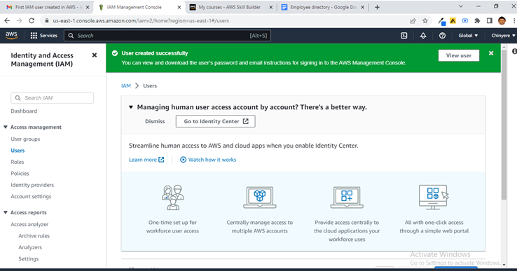
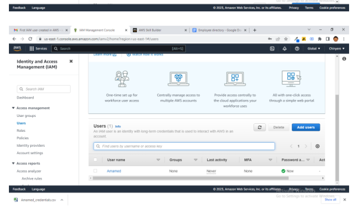
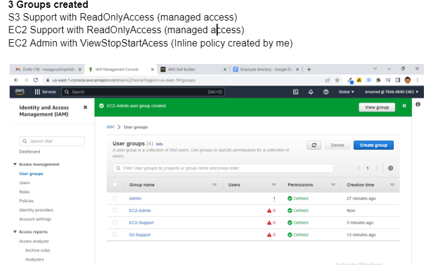
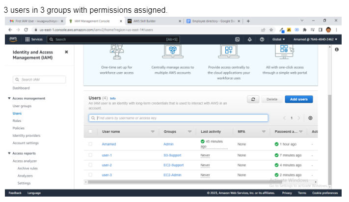
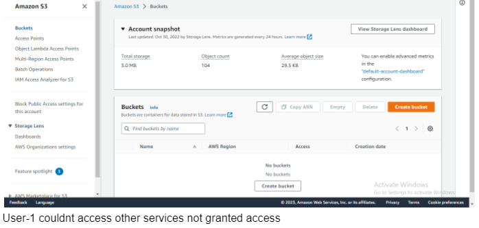
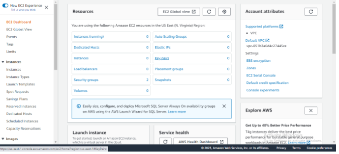
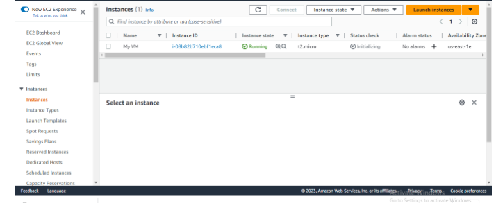

# Employee-Directory-webapp

A brief hands-on how to create a web app using a Virtual Machine (EC2 instance) in AWS.

# Conception - Creating Users and Groups

## Task

### Created an IAM User



I created an IAM user from the root account 



Created a group and labelled it Admin and then assigned Administrator access to the IAM User.

## Created 3 Users and 3 groups

I created user-1, user-2 and user-3



I further created 3 groups with permissions assigned to them which are:

S3 Support with ReadOnlyAccess

EC2 Support with ReadOnlyAccess

EC2 Admin with ViewStopStartAccess



user-1 and user-2 were assigned managed policies

user-3 was assigned an inline policy

I did the following to assign an inline policy.

I selected User Group on the management console, selected user-3, clicked on permissions and selected add permissions.

I went further to click on create inline policy.

The following commands were typed in

```
{
    "Version": "2012-10-17",
    "Statement": [
        {
            "Sid": "VisualEditor0",
            "Effect": "Allow",
            "Action": [
                "s3:*",
                "dynamodb:*",
                "ec2:*"
            ],
            "Resource": "*"
        }
    ]
}
```

## Testrunning the 3 users created

I tried signing in with the different users to ensure that they can access the permissions attached to them.

It was confirmed that they can only access the permissions granted to them.







I couldn't get my Employee Directory to open, though i am still trying to get it fixed.
